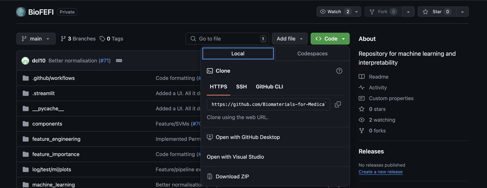
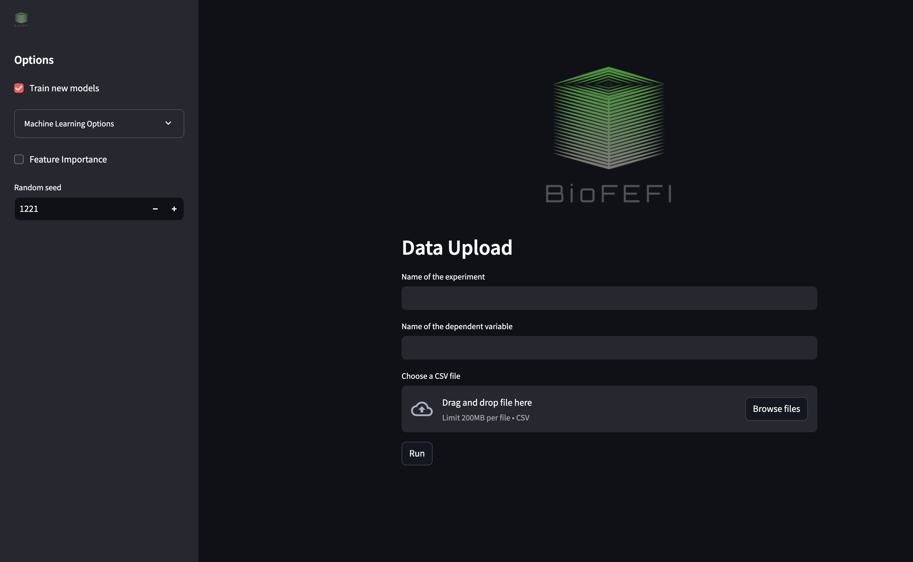

# BioFEFI: Python Toolkit for Machine Learning, Feature Importance, and Fuzzy Interpretation

## Overview

This toolkit provides a streamlined workflow for machine learning model training, feature importance analysis, and fuzzy interpretation. It includes pipelines for data ingestion, model training, feature importance evaluation, and fuzzy logic rule generation.

**Note**: The data used in this pipeline needs to be pre-cleaned and pre-modeled. This includes:
- Data type formatting
- Missing values resolved
- Outliers removed
- Feature engineering completed

The data should be in a format where all columns except the last one are input features, and the last column is the target variable.

## Installation

You can obtain a copy of the latest code by downloading it from Github. You can do this by donwloading the ZIP file using the button shown below:


Or by using the git command in the terminal:
```bash
git clone https://github.com/Biomaterials-for-Medical-Devices-AI/BioFEFI.git
```

You then need to set up a Python virtual environment. In the `BioFEFI` directory that you downloaded, use the following command in the terminal:

For MacOS / Linux
```bash
# create a virtual environment
python -m venv .venv

# activate the virtual environment
source .venv/bin/activate

# install the code and its dependencies in the virtual environment
pip install -r requirements.txt
```

For Windows
```powershell
# create a virtual environment
python -m venv .venv

# activate the virtual environment
source .venv\Scripts\activate

# install the code and its dependencies in the virtual environment
pip install -r requirements.txt
```

**NB:** if `python` doesn't work, try using `python3` instead.

## Running the app

If everything the installation was successful, you should be able to run the app. In the `BioFEFI` directory run the following command:

```bash
streamlit run ui.py
```

Remember to activate the virtual environment before running the app, if you haven't already (see [Installation](#installation)). The app will open in your web browser. Or you can follow follow this link to view your app http://localhost:8501.

You will see the following screen:


## Usage

On the left hand side of the screen, you will see the options for running the `BioFEFI` toolkit. By default it will train new machine learning models, but you can uncheck the checkbox that says "Train new models" and a new field will appear on the "Data Upload" form which will allow you to upload your own models. These models must be compatible with [scikit-learn](https://scikit-learn.org/stable/index.html). 

When training new models, you may select the "Feature Importance" checkbox and configure how to evaluate feature importance once the new models are trained.
If you choose to upload your own models, click the "Feature Importance" checkbox in order to evaluate your models.

Under "Feature Importance" there is a checkbox called "Fuzzy feature selection". Check this box to configure fuzzy feature selection.

On the "Data Upload" form, there are 3 fields, or 4 if you choose not to train new models. In the first field, you will enter the name of your experiment. Enter the name of the dependent variable in the second field. This will tell `BioFEFI` what to put on the plots in the output - the last (rightmost) column is used as the dependent varaible when actually running the pipeline. The third column is where you upload your training data, in the form of a CSV (`.csv`) file. If you unchecked the "Train new models" checkbox, the fourth field lets you upload multiple machine learning models as pickled objects (`.pkl`) (https://scikit-learn.org/stable/model_persistence.html#pickle-joblib-and-cloudpickle).

When you're happy with your input and configuration, press "Run" to start the pipeline. A "Cancel" button will appear underneath which will allow you stop the run at any point. A spinner will appear under the buttons to show the pipeline is working. Once complete, logs for the latest run of your experiment will appear and so will any plots generated.

## Pipelines

### 1. Feature Importance Options
- **Initialization**: 
  ```python
  fi_opt = FeatureImportanceOptions().parse()
  ```

### 2. Fuzzy Options
- **Initialization**: 
  ```python
  fuzzy_opt = FuzzyOptions().parse()
  ```

### 3. Machine Learning Options
- **Initialization**: 
  ```python
  ml_opt = MLOptions().parse()
  ```

### 4. Set Seed for Reproducibility
- **Setting the Seed**: 
  ```python
  seed = ml_opt.random_state
  set_seed(seed)
  ```

### 5. Logger Setup
- **Machine Learning Logger**: 
  ```python
  ml_logger_instance = Logger(ml_opt.ml_log_dir, ml_opt.experiment_name)
  ml_logger = ml_logger_instance.make_logger()
  ```
- **Feature Importance Logger**: 
  ```python
  fi_logger_instance = Logger(fi_opt.fi_log_dir, fi_opt.experiment_name)
  fi_logger = fi_logger_instance.make_logger()
  ```
- **Fuzzy Interpretation Logger**: 
  ```python
  fuzzy_logger_instance = Logger(fuzzy_opt.fuzzy_log_dir, fuzzy_opt.experiment_name)
  fuzzy_logger = fuzzy_logger_instance.make_logger()
  ```

### 6. Data Ingestion
- **Data Ingestion**: 
  ```python
  data = DataBuilder(ml_opt, ml_logger).ingest()
  ```

### 7. Machine Learning
- **Training Models**: 
  ```python
  trained_models = train.run(ml_opt, data, ml_logger)
  ```
- **Close Logger**: 
  ```python
  close_logger(ml_logger_instance, ml_logger)
  ```

### 8. Feature Importance
- **Running Feature Importance**: 
  ```python
  gloabl_importance_results, local_importance_results, ensemble_results = feature_importance.run(fi_opt, data, trained_models, fi_logger)
  ```
- **Close Logger**: 
  ```python
  close_logger(fi_logger_instance, fi_logger)
  ```

### 9. Fuzzy Interpretation
- **Running Fuzzy Interpretation**: 
  ```python
  fuzzy_rules = fuzzy_interpretation.run(fuzzy_opt, ml_opt, data, trained_models, ensemble_results, fuzzy_logger)
  ```
- **Close Logger**: 
  ```python
  close_logger(fuzzy_logger_instance, fuzzy_logger)
  ```

## Usage

1. **Set Up Options**: Configure your feature importance, fuzzy options, and machine learning options.
2. **Initialize Logger**: Set up logging for machine learning, feature importance, and fuzzy interpretation.
3. **Ingest Data**: Use the `DataBuilder` to ingest and prepare your data.
4. **Train Models**: Train your machine learning models using the configured options.
5. **Evaluate Feature Importance**: Run the feature importance analysis on the trained models.
6. **Fuzzy Interpretation**: Generate fuzzy logic rules based on the model and feature importance results.
7. **Close Loggers**: Ensure all loggers are properly closed after execution.

## Installation

1. Python --version: Python 3.12.4

2. Clone the repository:
   ```bash
   git clone <repository-url>
   ```
3. Install the required packages:
   ```bash
   pip install -r requirements.txt
   ```


---

