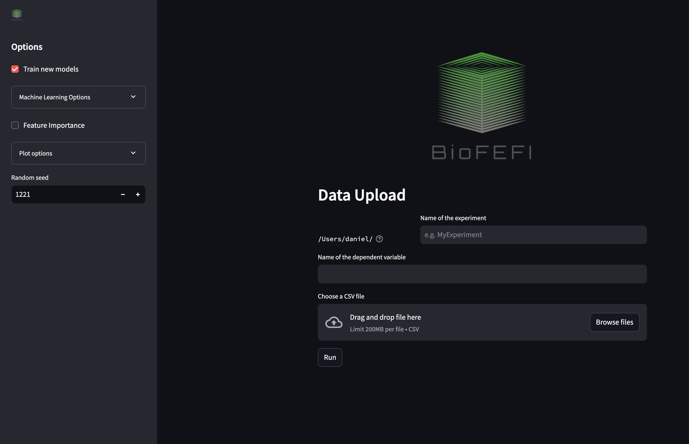

# BioFEFI: Python Toolkit for Machine Learning, Feature Importance, and Fuzzy Interpretation

## Overview

This toolkit provides a streamlined workflow for machine learning model training, feature importance analysis, and fuzzy interpretation. It includes pipelines for data ingestion, model training, feature importance evaluation, and fuzzy logic rule generation.

**Note**: The data used in this pipeline needs to be pre-cleaned and pre-modeled. This includes:
- Data type formatting
- Missing values resolved
- Outliers removed
- Feature engineering completed

The data should be in a format where all columns except the last one are input features, and the last column is the target variable.

## Installation

You can obtain a copy of the latest code by downloading it from Github. You can do this by donwloading the ZIP file using the button shown below:


Or by using the git command in the terminal:
```bash
git clone https://github.com/Biomaterials-for-Medical-Devices-AI/BioFEFI.git
```

You then need to set up a Python virtual environment. In the `BioFEFI` directory that you downloaded, use the following command in the terminal:

For MacOS / Linux
```bash
# create a virtual environment
python -m venv .venv

# activate the virtual environment
source .venv/bin/activate

# install the code and its dependencies in the virtual environment
pip install -r requirements.txt
```

For Windows
```powershell
# create a virtual environment
python -m venv .venv

# activate the virtual environment
source .venv\Scripts\activate

# install the code and its dependencies in the virtual environment
pip install -r requirements.txt
```

**NB:** if `python` doesn't work, try using `python3` instead.

## Running the app

If everything the installation was successful, you should be able to run the app. In the `BioFEFI` directory run the following command:

```bash
streamlit run ui.py
```

Remember to activate the virtual environment before running the app, if you haven't already (see [Installation](#installation)). The app will open in your web browser. Or you can follow follow this link to view your app http://localhost:8501.

You will see the following screen:


## Configuration

Users can customize the pipeline configurations in the following files:

- **machine_learning/ml_options.py**: Configure all machine learning settings, including selecting ML algorithms, feature scaling, data splitting, specifying the ML logging directory, and setting the `data_path`.
- **feature_importance/feature_importance_options.py**: Select methods for global, local, and ensemble feature importance, and set feature importance flags.
- **feature_importance/fuzzy_options.py**: Configure fuzzy feature selection, fuzzy granularity, the number of features to select, the number of target categories, and other fuzzy interpretation flags.
- **base_options.py**: Define the type of machine learning problem.

## Pipelines

### 1. Feature Importance Options
- **Initialization**: 
  ```python
  fi_opt = FeatureImportanceOptions().parse()
  ```

### 2. Fuzzy Options
- **Initialization**: 
  ```python
  fuzzy_opt = FuzzyOptions().parse()
  ```

### 3. Machine Learning Options
- **Initialization**: 
  ```python
  ml_opt = MLOptions().parse()
  ```

### 4. Set Seed for Reproducibility
- **Setting the Seed**: 
  ```python
  seed = ml_opt.random_state
  set_seed(seed)
  ```

### 5. Logger Setup
- **Machine Learning Logger**: 
  ```python
  ml_logger_instance = Logger(ml_opt.ml_log_dir, ml_opt.experiment_name)
  ml_logger = ml_logger_instance.make_logger()
  ```
- **Feature Importance Logger**: 
  ```python
  fi_logger_instance = Logger(fi_opt.fi_log_dir, fi_opt.experiment_name)
  fi_logger = fi_logger_instance.make_logger()
  ```
- **Fuzzy Interpretation Logger**: 
  ```python
  fuzzy_logger_instance = Logger(fuzzy_opt.fuzzy_log_dir, fuzzy_opt.experiment_name)
  fuzzy_logger = fuzzy_logger_instance.make_logger()
  ```

### 6. Data Ingestion
- **Data Ingestion**: 
  ```python
  data = DataBuilder(ml_opt, ml_logger).ingest()
  ```

### 7. Machine Learning
- **Training Models**: 
  ```python
  trained_models = train.run(ml_opt, data, ml_logger)
  ```
- **Close Logger**: 
  ```python
  close_logger(ml_logger_instance, ml_logger)
  ```

### 8. Feature Importance
- **Running Feature Importance**: 
  ```python
  gloabl_importance_results, local_importance_results, ensemble_results = feature_importance.run(fi_opt, data, trained_models, fi_logger)
  ```
- **Close Logger**: 
  ```python
  close_logger(fi_logger_instance, fi_logger)
  ```

### 9. Fuzzy Interpretation
- **Running Fuzzy Interpretation**: 
  ```python
  fuzzy_rules = fuzzy_interpretation.run(fuzzy_opt, ml_opt, data, trained_models, ensemble_results, fuzzy_logger)
  ```
- **Close Logger**: 
  ```python
  close_logger(fuzzy_logger_instance, fuzzy_logger)
  ```

## Usage

1. **Set Up Options**: Configure your feature importance, fuzzy options, and machine learning options.
2. **Initialize Logger**: Set up logging for machine learning, feature importance, and fuzzy interpretation.
3. **Ingest Data**: Use the `DataBuilder` to ingest and prepare your data.
4. **Train Models**: Train your machine learning models using the configured options.
5. **Evaluate Feature Importance**: Run the feature importance analysis on the trained models.
6. **Fuzzy Interpretation**: Generate fuzzy logic rules based on the model and feature importance results.
7. **Close Loggers**: Ensure all loggers are properly closed after execution.

## Installation

1. Python --version: Python 3.12.4

2. Clone the repository:
   ```bash
   git clone <repository-url>
   ```
3. Install the required packages:
   ```bash
   pip install -r requirements.txt
   ```


---

