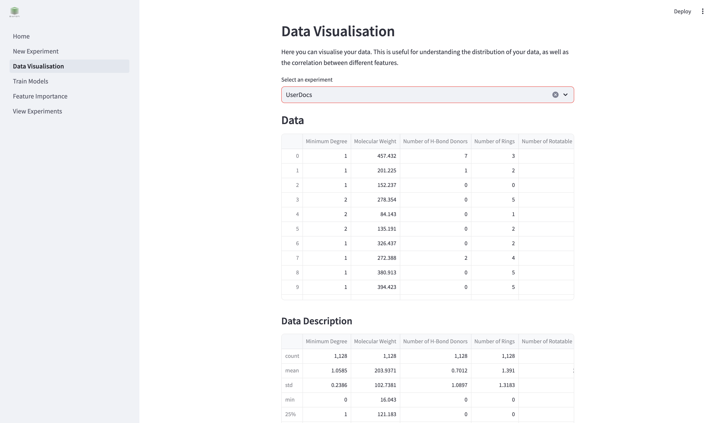
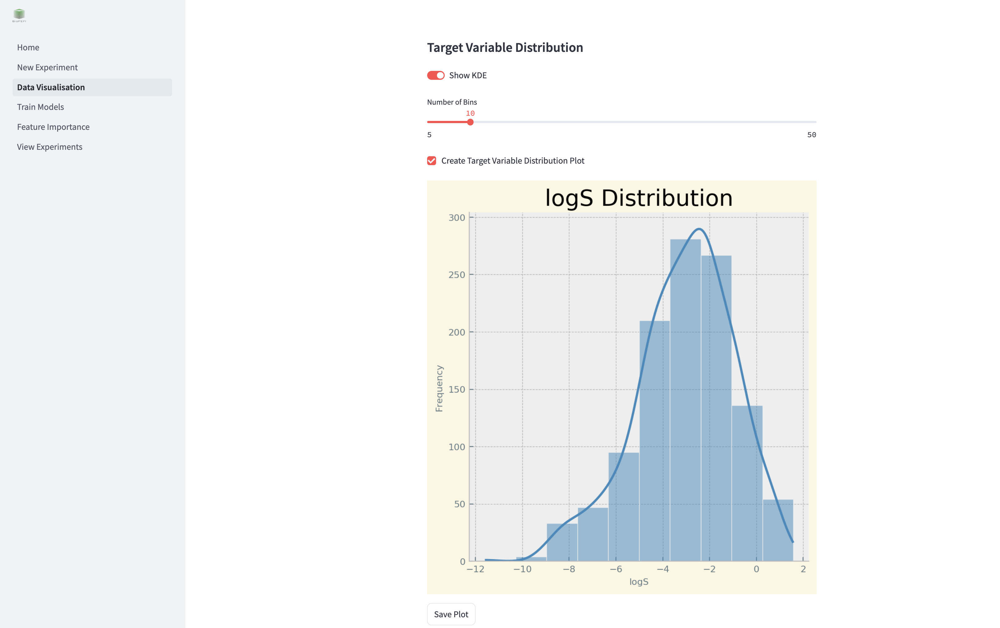
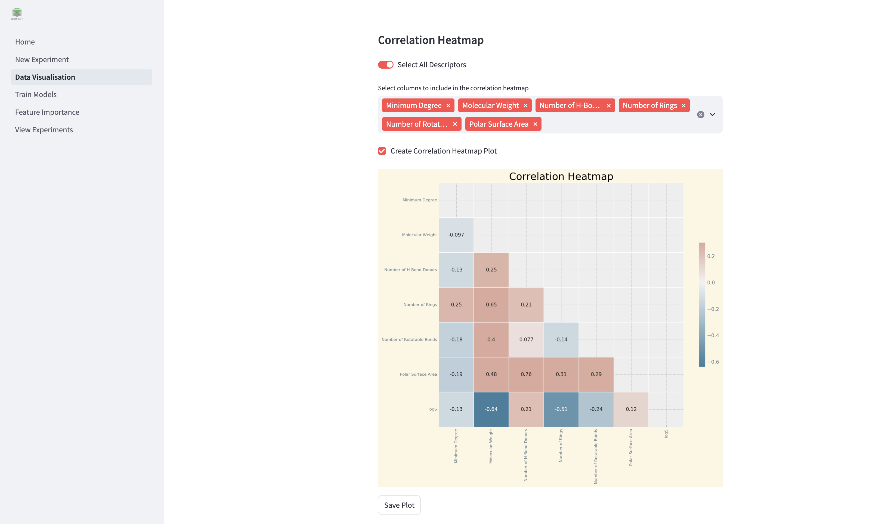
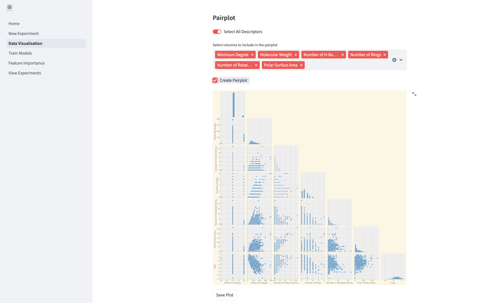
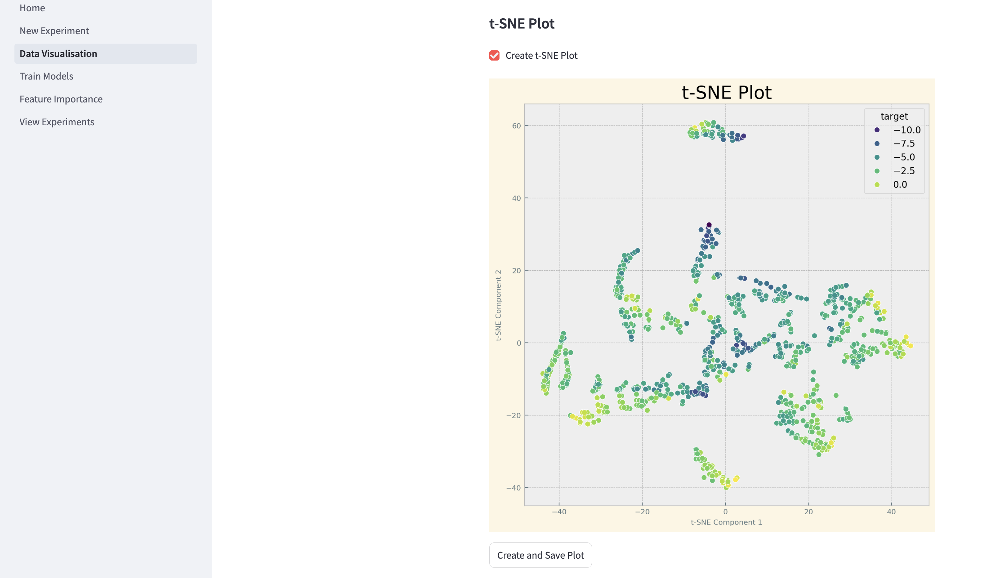
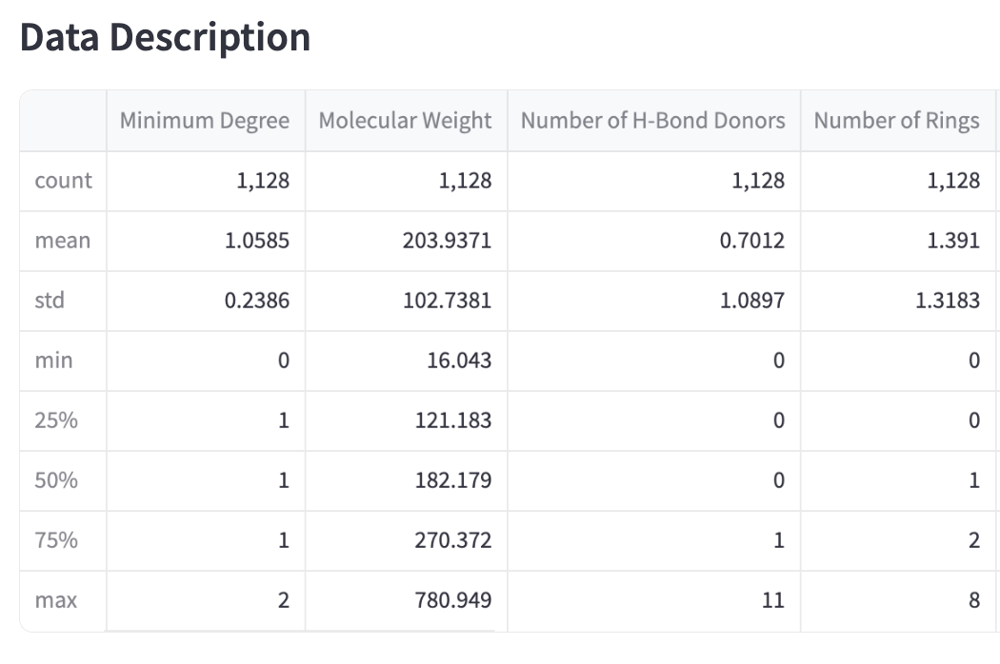

# Data Visualization
The **Data Visualization** page allows you to explore and analyze your data using a variety of visual tools. This helps in understanding data distributions, correlations, and feature interactions.

To begin, select your experiment from the dropdown menu where it says **"Select an experiment"**. This will load the dataset associated with your selected experiment.

## Visualization Options
The page provides the following visualization tools:

### Target Variable Distribution
Visualize the distribution of your target variable using histograms and KDE (Kernel Density Estimation).

- **Show KDE**: Toggle to include a KDE curve.
- **Number of Bins**: Adjust the number of bins in the histogram.

### Correlation Heatmap
Display a heatmap showing correlations between selected features.

- **Select All Descriptors**: Include all features in the heatmap.
- **Select Columns**: Manually select specific features for the heatmap.

### Pairplot
Generate pairwise scatter plots for selected features to identify trends and interactions.

- **Select All Descriptors**: Include all features in the pairplot.
- **Select Columns**: Manually select specific features for pairplot generation.

### t-SNE Plot
Visualize high-dimensional data in two dimensions using t-SNE.

## Saving Visualizations
You can save generated plots to disk for reporting or further analysis. The save options are located below each plot tool.

## Data Description
Below the visualization tools, the page displays:
- The loaded dataset.
- A summary of the dataset, including mean, standard deviation, and other statistics.

## How to Start
1. Select an experiment.
2. Choose the visualization type.
3. Adjust parameters as needed.
4. Click the buttons to generate and save visualizations.

Press **"Create and Save"** to save plots for further use.
