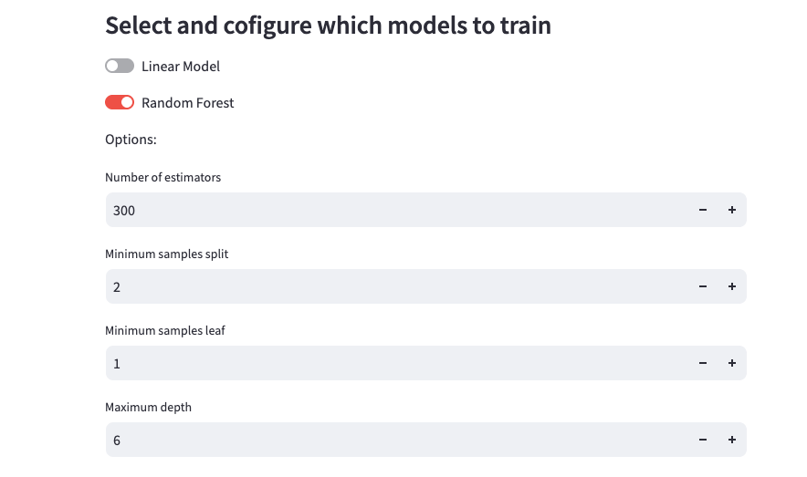
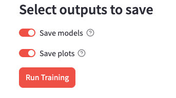

# Training models
You can train new models in BioFEFI by clicking on **"Train Models"** on the left hand side of the screen.

To begin, select your experiment from the dropdown menu where it says **"Select an experiment"**.

## Selecting models to train
To select which models you wish to train, click the toggles next to the model type you wish to train. When you click a toggle, that model's configurable hyper-parameters will appear underneath that toggle. You may train more than one model at a time.

Depending on whether your problem type, which was configured on the [New Experiment page](../users/create_experiment.md), the models will either be a **classifier** or a **regressor**.

### Options
- **Linear Model**

  If the problem type is "Classification", train a [Logistic Regression](https://scikit-learn.org/1.5/modules/generated/sklearn.linear_model.LogisticRegression.html) model. If the problem type is "Regression", train a [Linear Regression](https://scikit-learn.org/1.5/modules/generated/sklearn.linear_model.LinearRegression.html) model.

  - Fit intercept: if true, the model will calculate the y-intercept to use in the predictions. If not, the data must be centered.

- **Random Forest**

  If the problem type is "Classification", train a [Random Forest Classifier](https://scikit-learn.org/1.5/modules/generated/sklearn.ensemble.RandomForestClassifier.html) model. If the problem type is "Regression", train a [Random Forest Regressor](https://scikit-learn.org/1.5/modules/generated/sklearn.ensemble.RandomForestRegressor.html) model.

  - Number of estimators: The number of decision trees in the forest.
  - Minimum samples split: The minimum number of samples to split an internal node.
  - Minimum samples leaf: The minimum number of samples required to be a leaf node.
  - Maximum depth: The maximum depth of the tree.

- **XGBoost**

  If the problem type is "Classification", train a [XGB Classifier](https://xgboost.readthedocs.io/en/latest/python/python_api.html#xgboost.XGBClassifier) model. If the problem type is "Regression", train a [XGB Regressor](https://xgboost.readthedocs.io/en/latest/python/python_api.html#xgboost.XGBRegressor) model.

  - Number of estimators: The number of boosting rounds.
  - Maximum depth: The maximum depth of the base learners.
  - Learning rate: Boosting learning rate.
  - Subsample size: Subsample ratio of the training instance.

- **Support Vector Machine**

  If the problem type is "Classification", train a [SVM Classifier](https://scikit-learn.org/1.5/modules/generated/sklearn.svm.SVC.html) model. If the problem type is "Regression", train a [SVM Regressor](https://scikit-learn.org/1.5/modules/generated/sklearn.svm.SVR.html) model.

  - Kernel: The kernel type for the algorithm.
  - Degree: The degree for the polynomial kernel - ignored if not using the polynomial kernel.
  - C: Regularisation parameter.

## Saving the outputs
You have the option to save the models and the plots to disk. Click the toggles to turn on/off.

## Train
Once you have configured which models to train, hit the **"Run Training"** button.